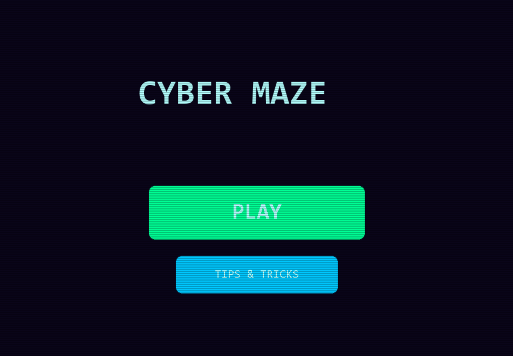
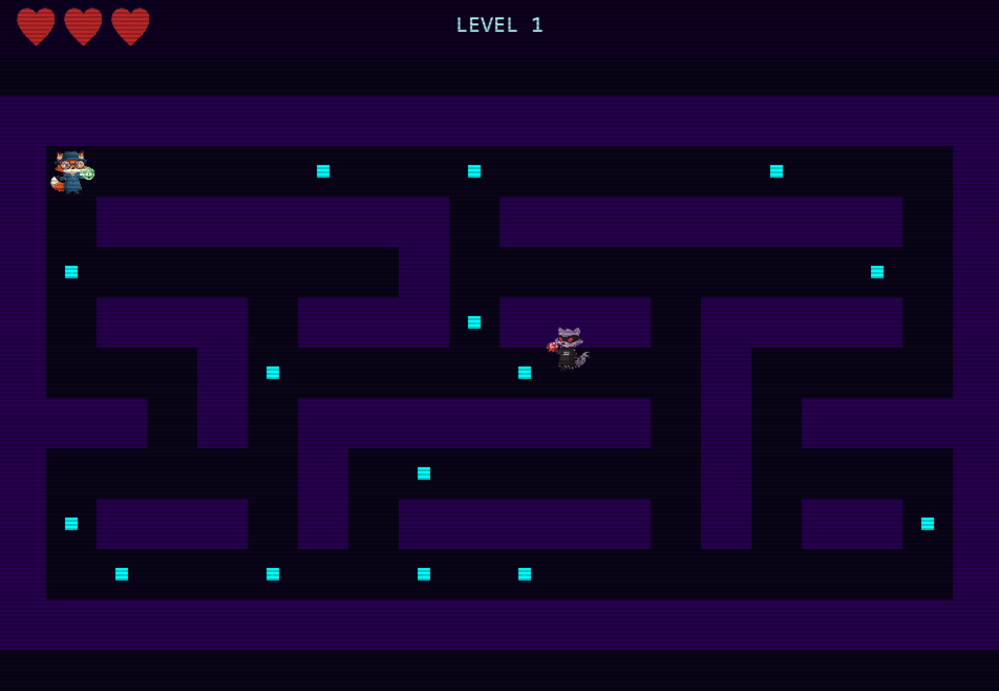
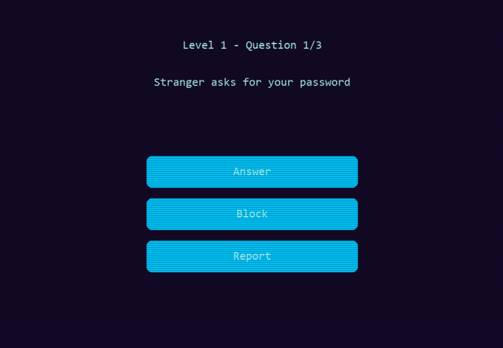
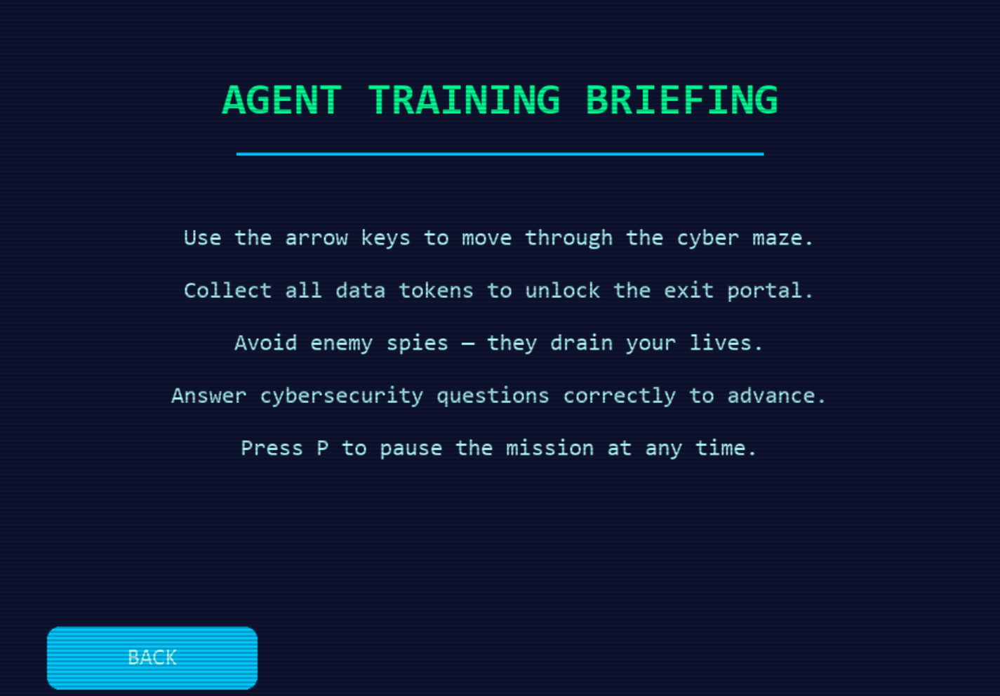
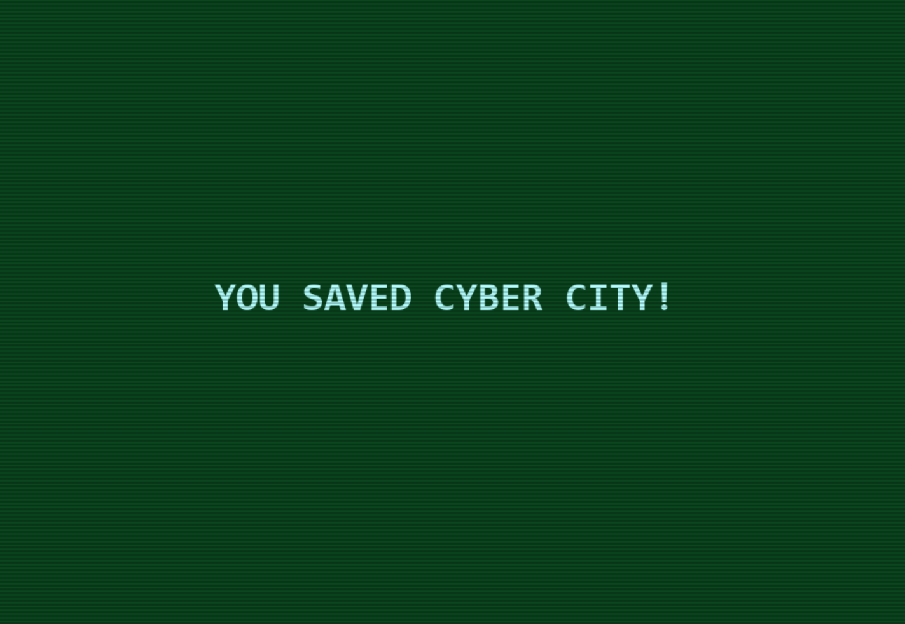

# Cyber-Maze

\# 🎮 Cyber Maze

Cyber Maze is an educational 2D arcade-style maze game focused on cybersecurity awareness.  

The game combines movement, strategy, and quiz-based learning inside a neon cyber-themed environment.

---

\# 🇲🇰 Македонска верзија

\## 📌 Опис на проектот

Cyber Maze е 2D едукативна игра изработена во Python со користење на Pygame библиотеката.  

Играчот влегува во сајбер лавиринт каде што треба да собира податочни токени, да избегнува непријателски агенти и да одговара на прашања поврзани со сајбер безбедност.

Играта има за цел да ја комбинира забавата со едукацијата, при што корисникот преку интерактивен квиз учи за безбедно однесување на интернет, препознавање измами и заштита на лични податоци.

---

\## 🎯 Цел на играта

Главната цел на играта е:

\- Да се соберат сите токени во лавиринтот

\- Да се отклучи порталот кон следното ниво

\- Да се одговорат точно квиз прашањата

\- Да се преживее избегнувајќи ги непријателите

Играчот има ограничен број на животи.  

Секој контакт со непријател одзема еден живот.  

Доколку сите животи се изгубат, играта завршува.

---

\## 🕹 Како се игра

\### Контроли:

\- ⬅️ ➡️ ⬆️ ⬇️ Стрелки за движење

\- P – Пауза (Mission Control)

\- ESC – Излез од играта

\### Играчки механики:

\- Движење низ лавиринт со 3 различни нивоа

\- Секое ниво има динамични непријатели

\- По собирање на сите токени се појавува портал

\- Влегување во портал активира квиз

\- За напредување потребно е точно да се одговорат прашањата

---

\## 🧠 Едукативен аспект

Квизот опфаќа теми како:

\- Споделување лични информации

\- Препознавање измами

\- Сајбер малтретирање

\- Лажни наградни игри

\- Сомнителни линкови

Секоe прашање има објаснување со цел играчот да разбере зошто одговорот е точен или неточен.

---

\## 🛠 Технологии

\- Python 3

\- Pygame

\- PyInstaller (за креирање извршна .exe верзија)

---

\## ▶️ Извршна верзија (.exe)

Преземи ја извршната верзија тука:

🔗 https://github.com/IvonaEftimovska/Cyber-Maze/releases/tag/v1.0

---

\# 🇬🇧 English Version

\## 📌 Project Description

Cyber Maze is a 2D educational arcade-style game developed using Python and the Pygame library.  

The player navigates through a cyber-themed maze, collects encrypted tokens, avoids hostile agents, and completes cybersecurity quiz challenges.

The game is designed to combine entertainment with learning, helping players improve their awareness of online safety and cybersecurity principles.

---

\## 🎯 Game Objective

The main objectives of the game are:

\- Collect all tokens within the maze

\- Unlock the portal to the next level

\- Successfully complete quiz challenges

\- Survive enemy encounters

The player has a limited number of lives.  

Each enemy collision removes one life.  

If all lives are lost, the game ends.

---

\## 🕹 How to Play

\### Controls:

\- ⬅️ ➡️ ⬆️ ⬇️ Arrow keys to move

\- P – Pause (Mission Control)

\- ESC – Exit the game

\### Gameplay Mechanics:

\- Navigate through 3 progressively challenging levels

\- Avoid moving enemy agents

\- Collect all tokens to activate the portal

\- Entering the portal triggers a cybersecurity quiz

\- Correct answers are required to advance

---

\## 🧠 Educational Component

The integrated quiz includes topics such as:

\- Sharing personal information online

\- Recognizing scams and fake giveaways

\- Cyberbullying awareness

\- Suspicious pop-ups and phishing

\- Safe digital communication

Each question includes an explanation to reinforce learning.

---

\## 🛠 Technologies Used

\- Python 3

\- Pygame

\- PyInstaller (for executable build)

---

## 📸 Game Screenshots

## 📸 Game Screenshots

### 🏠 Main Menu

### 🧩 Maze Gameplay

### ❓ Quiz Screen

### 💀 Game Over

## Tips and Tricks

## Game Complete

\## ▶️ Executable Version (.exe)

Download the executable version here:

🔗 https://github.com/IvonaEftimovska/Cyber-Maze/releases/tag/v1.0

